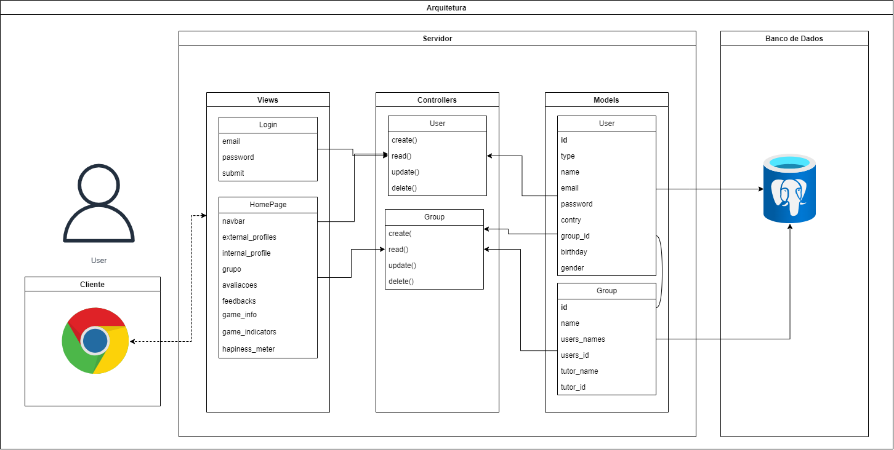

&nbsp;&nbsp;&nbsp;&nbsp;A arquitetura apresentada a seguir se refere ao projeto desenvolvido pelo Grupo 4, C3 - Code Connecting Cultures, referente ao Módulo 2 da Turma 12 do Inteli - Instituto de Tecnologia e Liderança e segue a padronização **MVC - *Model*-*View*-*Controller*** e possui finalizade exclusiva de aprendizado acadêmico.

Figura 1 - Protótipo Arquitetura MVC

Fonte: Material desenvolvido pelo autor

&nbsp;&nbsp;&nbsp;&nbsp;A arquitetura foi consruída a partir do que já havia sido definido, pelo grupo, como inerente ao projeto a ser desenvolvido, isto é, a partir dos elementos do projeto que certamente seriam desenvolvidos. Sendo assim, essa arquitetura **não** contempla o projeto em sua complitude.

&nbsp;&nbsp;&nbsp;&nbsp;Os ***Views*** do projeto dizem respeito às páginas tanto de ***LogIn***, que possui os atributos *email*, *password* e *submit*, os quais se relacionam com os elementos disponíveis nessa página, quanto ***HomePage***, que possui os atributos *navbar* (a barra de navegação presente que ficará presente no topo da página), *external_profiles*(os perfis tanto dos outros integrantes do time quanto do(a) tutor(a) que ficarão localizados do lado esquerdo da página), *game_info*, *game_indicators*, *happiness_metter*, esses 3 fazendo referência aos conteúdos principais que serão disponibilizados na página, *internal_profile*, *grupo*, *avaliacoes* e *feedbacks*, esses últimos que serão as seções de redirecionamento no topo da página, como pode ser visualizado no *wireframe* a seguir.

Figura 2 - Wireframe Página Login

Fonte: Material desenvolvido pelo Grupo 4

&nbsp;&nbsp;&nbsp;&nbsp;Já os ***Controllers*** contém os métodos que serão utilizados nas entidades User e Group, as quais fazem referência aos usuários que acessam o servidor e aos grupos que estão presentes nele, respectivamente. Os métodos apresentados são apenas métodos básicos utilizados em qualquer servidor para qualquer entidade, uma vez que ainda não se tem uma noção completa dos métodos que de fato serão utilizados para as entidades além desses no momento em que a arquitetura foi desenvolvida.

&nbsp;&nbsp;&nbsp;&nbsp;Com relação aos ***Models*** utilizados no *back-end* da aplicação *web* a ser desenvolvida, é possível observar que serão relevantes para o funcionamento dela os atributos *id*, sendo esse a **chave-primária** da entidade, *type* (o tipo de usuário entre estudante, tutor e, possivelmente, administrador), *name*, *email*, *password*, *country*, *group_id*, sendo esse a **chave-estrangeira** que se relaciona com a entidade Grupo nos ***Models***, *birthday* e *gender*; com relação à entidade User e *id*, sendo esse a **chave-primária** da entidade, *name*, *users_names*, *users_ids*, sendo esse a **chave-estrangeira** que se relaciona com a entidade Usuáro nos ***Models*** e *tutor_name*.

&nbsp;&nbsp;&nbsp;&nbsp;O navegador *web*, seja ele qual for, se relacionará com os ***Views*** na arquitetura do projeto, bem como os ***Views*** se relacionarão com o navegador, de modo a criar uma comunicação por meio dos protocolos existentes na *Internet*. Já o banco de dados **PostgreeSQL** utilizado e gerenciado por meio do **SGBD** (**Sistema Gerenciador de Banco de Dados**) **Dbeaver** receberá informações dos ***Models*** existentes, de forma que seja atualizado constantemente. É válido ressaltar, também, que o *back-end* proposto será desenvolvido por meio das tecnologias **Node.js** e **Sails.js**, bem como utilizando da linguagem **JavaScript**.